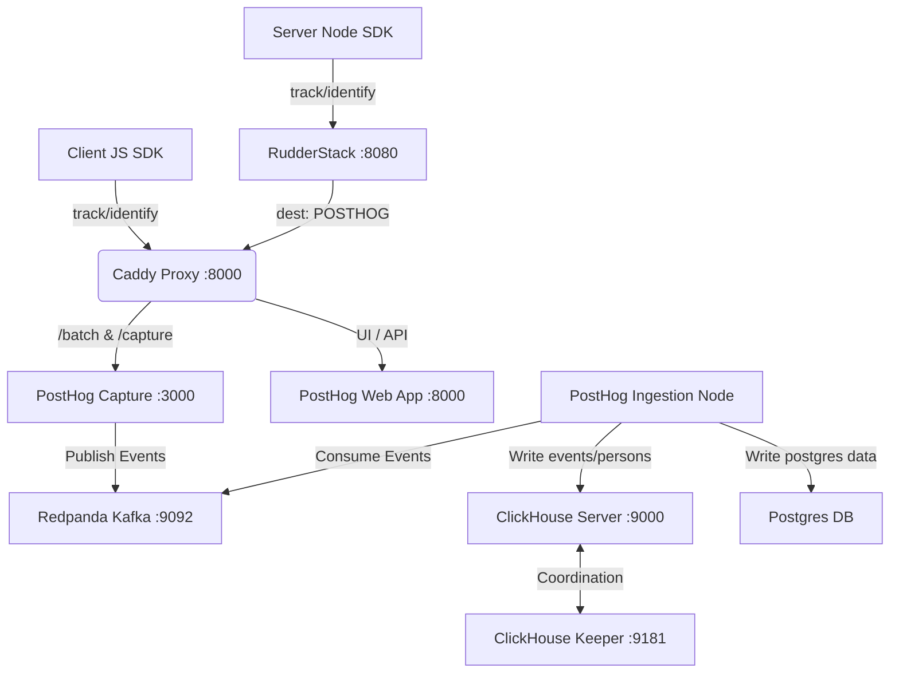

# CDP Hosting Setup: RudderStack + PostHog

This document provides a comprehensive summary of the architecture, resolved issues, configuration details, and client integration instructions for the hosted Customer Data Platform (CDP) on EC2.

---

## 1. Architecture Overview

Here is the data flow topology of the hosted stack:



---

## 2. Solved Issues & Troubleshooting History

We resolved the following technical blockers to successfully boot the stack:

1. **ZooKeeper / ClickHouse Keeper Integration**: ClickHouse migrations initially failed due to ZooKeeper connection errors. We configured ClickHouse's built-in single-node **Keeper** service to handle Coordination/Raft consensus on port `9181`.
2. **Missing Macros**: ClickHouse `ReplicatedMergeTree` queries failed with `No macro 'replica' in config`. We added `<replica>1</replica>` and `<shard>1</shard>` macros to `infrastructure/clickhouse/clusters.xml`.
3. **Hardcoded ClickHouse Cluster Names**: PostHog expects multiple service-specific clusters to be declared (`posthog_primary_replica`, `posthog_single_shard`, `posthog_writable`, `batch_exports`, etc.). We added these aliases pointing to `posthog-clickhouse` in the clickhouse configuration.
4. **Kafka Named Collections Address Resolution**: ClickHouse initially could not connect to Redpanda because named collections (`msk_cluster` and `warpstream_*`) had `<kafka_broker_list>` set to `localhost:9092`. We updated these to `kafka:9092` so they resolve inside the container bridge network.
5. **Memory Constraint (OOM Killed)**: The 4GB RAM instance ran out of memory during migrations. We configured a persistent **4GB swapfile** on the host, which allowed the stack to compile and run Django tasks without crashing.
6. **Capture Ingestion Service addition**: Django's backend returns a `CSRF 403` on external ingestion (`/batch`). We imported PostHog's Rust capture service and Node ingestion services into `docker-compose.cdp.yml` to bypass the Django CSRF gate and consume events asynchronously.

---

## 3. Configuration Details

### In-Scope Configuration Files:
* **Docker Compose**: `docker-compose.cdp.yml`
* **ClickHouse Config**: `infrastructure/clickhouse/clusters.xml`
* **RudderStack Config**: `infrastructure/rudderstack/workspaceConfig.json`
* **Environment File**: `.env.cdp`

---

## 4. Verification & Testing

We performed end-to-end event delivery testing:
1. Submitted a track payload to RudderStack via curl.
2. Verified the router delivered it successfully (`succeeded` in Rudder's Postgres jobs).
3. Queried ClickHouse to confirm ingestion:

```sql
SELECT event, distinct_id, properties FROM events ORDER BY timestamp DESC LIMIT 3
```

**Result:**
```text
test_event_cdp_2        test-user-2             {"$timestamp":"2026-07-07T12:37:55.359Z","distinct_id":"test-user-2","hello":"world","number":100}
manual_proxy_smoke      test-user-direct        {"timestamp":"2026-07-07T12:35:22.843Z","source":"manual-direct"}
test_event_cdp          test-user-1             {"$timestamp":"2026-07-07T12:35:22.843Z","hello":"world","number":42}
```

---

## 5. Client Integration Environment Variables

Use the following parameters to connect your web, mobile, and server applications:

| Variable | Value | Description |
|---|---|---|
| **`RUDDERSTACK_DATA_PLANE_URL`** | `http://localhost:8080` | Endpoint for sending client/server events via RudderStack SDKs |
| **`RUDDERSTACK_BACKEND_WRITE_KEY`** | `rbs_36b0b76d1de95af77a05ca30fc46328cf70b07af` | Node/Server SDK source write key |
| **`RUDDERSTACK_WEB_WRITE_KEY`** | `rws_2cb392007d9b69839f418856bfa09a7d2e296419` | Javascript/Browser SDK source write key |
| **`POSTHOG_HOST`** | `http://localhost:8000` | Direct capture/UI endpoint for PostHog |
| **`POSTHOG_PROJECT_API_KEY`** | `phc_A4Gnk9ev6nQJ8TfXoAq48DusKakeCBpgJNagZbp9ek3b` | Project Token (Write Key) for PostHog |
