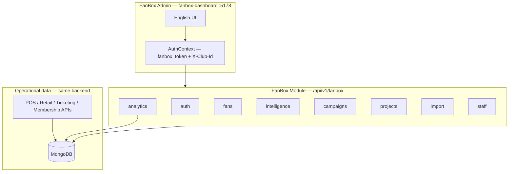
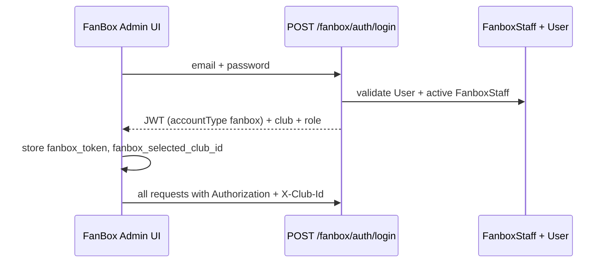
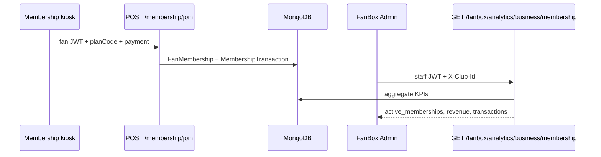

# FanBox Admin — Workflow & API Reference

**Audience:** FanBox staff, integrators, and engineering  
**App:** `fanbox-dashboard` → http://localhost:5178  
**Backend module:** `/api/v1/fanbox` on main Coxa API (:5000)  
**Related:** [FANBOX_CLUSTER.md](../backend/FANBOX_CLUSTER.md) · [FANBOX_APPROVAL.md](./FANBOX_APPROVAL.md) · [POS Integration API](/api/docs)

---

## 1. Architecture overview



| Layer | Role |
|-------|------|
| **fanbox-dashboard** | Staff UI — read analytics, manage campaigns, filters, projects, imports, users |
| **FanBox API** | Staff-authenticated REST under `/api/v1/fanbox/*` |
| **POS Integration API** | External write APIs (documented in `openapi-pos.yaml`) that **feed** Business tab data |
| **MongoDB** | Single source of truth — FanBox reads aggregates; POS/ops modules write transactions |

**Important:** FanBox admin APIs are **read/manage FanBox features**. Business KPIs (Membership, Tickets, Stores, etc.) come from **operational writes** documented in the [POS Integration API](#6-pos-integration-api-documented-endpoints).

---

## 2. Getting started

### Run locally

```bash
npm run seed --workspace=coxa-backend          # demo data + FanboxStaff
npm run dev --workspace=coxa-backend           # :5000
npm run dev --workspace=fanbox-dashboard         # :5178
```

### Demo credentials

| User | Password | FanBox role |
|------|----------|-------------|
| `admin@coxa.local` | `CoxaDemo123!` | `fanbox_admin` |
| `marketing@coxa.local` | `CoxaDemo123!` | `fanbox_manager` |
| `loyalty@coxa.local` | `CoxaDemo123!` | `fanbox_marketer` |

### Tenant / module

- Tenant ID default: `coxa-club-001` (`DEFAULT_TENANT_ID`)
- Module gate: `fanbox` must be in `TenantConfig.enabledModules` (seed adds it; dev startup auto-enables)

### API docs (ReDoc)

| Document | URL | Spec file |
|----------|-----|-----------|
| **POS Integration** (external integrators) | http://localhost:5000/api/docs | `backend/src/openapi/openapi-pos.yaml` |
| **Full internal API** | http://localhost:5000/api/docs/full | `backend/src/openapi/openapi.yaml` |

FanBox-specific routes are in the **full** spec under `/api/v1/fanbox/*`. The **POS** spec documents write APIs that populate Business data.

---

## 3. Authentication workflow

### 3.1 Login flow



| Step | UI | API |
|------|-----|-----|
| 1 | `/login` — email + password | `POST /api/v1/fanbox/auth/login` |
| 2 | Redirect to `/` | Response: `data.token`, `data.club`, `data.staff.role` |
| 3 | Session stored | `localStorage`: `fanbox_token`, `fanbox_selected_club_id` |
| 4 | Every request | Headers: `Authorization: Bearer <token>`, `X-Club-Id: <clubId>` |
| 5 | Session refresh | `GET /api/v1/fanbox/auth/me` |
| 6 | Multi-club switch | `GET /api/v1/fanbox/auth/clubs` + update `X-Club-Id` |
| 7 | Logout | Clear tokens → `/login` |

**Auth is separate from club-dashboard.** Users need a `FanboxStaff` record for the club; club RBAC alone is not enough.

### 3.2 Request headers (all authenticated FanBox calls)

```
Authorization: Bearer <fanbox JWT>
X-Club-Id: <MongoDB club ObjectId>
Content-Type: application/json
```

`X-Club-Id` resolves `tenantId` via `resolveTenantContext` middleware.

---

## 4. Roles & module access

Defined in `backend/src/lib/fanboxRoles.js` and enforced in UI via `ModuleRoute`.

| Role | Modules | Staff management |
|------|---------|------------------|
| `fanbox_admin` | All (fans, business, projects, intelligence, campaigns, control) | Yes |
| `fanbox_manager` | fans, business, projects, intelligence, campaigns | No |
| `fanbox_analyst` | fans, intelligence, business | No |
| `fanbox_marketer` | fans, intelligence, campaigns, projects | No |
| `fanbox_viewer` | fans (dashboard + fan views only) | No |

Sidebar sections hidden when the role lacks module access. Direct URL navigation redirects to `/`.

---

## 5. Admin workflows by section

### 5.1 Overview Dashboard (`/`)

**Purpose:** Fan base health, growth, engagement, and spend at a glance.

**Workflow:**
1. Sign in → land on Overview
2. Optional: set **date range** (filters engagement/spend/growth APIs)
3. View **Fan base overview** KPI cards (total fans, CPF, email, phone, address)
4. Review **Growth & trends** chart (monthly registrations)
5. Review **Engagement & spend** — stat cards + tables side by side

| User action | FanBox API | Data source |
|-------------|------------|-------------|
| Load counters | `GET /fanbox/analytics/fan-counters` | `FanProfile` aggregation |
| Load growth chart | `GET /fanbox/analytics/fan-growth?granularity=month&from=&to=` | `FanProfile.createdAt` |
| Load engagement | `GET /fanbox/analytics/engagement-reports?from=&to=` | `AttendanceRecord`, `Ticket`, `CampaignParticipation` |
| Load spend | `GET /fanbox/analytics/spend-reports?from=&to=` | `Sale`, `MembershipTransaction` |

---

### 5.2 Fans

#### Single Fan View (`/fans/single`)

**Workflow:**
1. Choose search field (email, CPF, name, fan ID, passport, phone)
2. Search → pick fan from results
3. View Customer 360 (profile, traits, membership, tickets, spend summary)
4. Optionally edit profile fields

| User action | FanBox API |
|-------------|------------|
| Search | `GET /fanbox/fans/search?q=&field=` |
| Customer 360 | `GET /fanbox/fans/customer-360?q=` or `GET /fanbox/fans/customer-360/:id` |
| Update profile | `PATCH /fanbox/fans/:id` |

#### Engagement (`/fans/engagement`)

**Workflow:**
1. Set date range
2. View weekly growth chart
3. Review KPI stat row + attendance and spend tables

| User action | FanBox API |
|-------------|------------|
| Growth | `GET /fanbox/analytics/fan-growth?granularity=week` |
| Engagement / spend | Same as Overview engagement + spend endpoints |

#### Profile Demographics (`/fans/profiles`)

**Workflow:**
1. Load demographic breakdown charts (city, state, gender, age, etc.)

| User action | FanBox API |
|-------------|------------|
| Demographics | `GET /fanbox/analytics/fan-demographics` |

---

### 5.3 Business (`/business/*`)

**Purpose:** Operational KPIs by revenue source (10 tabs).

**Workflow:**
1. Open Business → default tab **Membership**
2. Set **date range** (applies to all business tabs via layout context)
3. Switch sub-nav tab (Membership, Tickets, Access, Stores, …)
4. View KPI stat cards, bar chart, detail table

| Tab | Route | FanBox read API | Data fed by (POS / ops) |
|-----|-------|-----------------|-------------------------|
| Membership | `/business/membership` | `GET /fanbox/analytics/business/membership` | [Membership APIs](#membership-apis) |
| Tickets | `/business/tickets` | `.../business/tickets` | [Ticketing APIs](#ticketing-apis) |
| Access | `/business/access` | `.../business/access` | Gate validate + check-in + no-shows |
| Stores | `/business/stores` | `.../business/stores` | `POST /retail/sales` (store location) |
| E-Commerce | `/business/ecommerce` | `.../business/ecommerce` | `POST /retail/shop/orders` |
| Coxa Foods | `/business/coxa-foods` | `.../business/coxa-foods` | `POST /retail/sales` (fnb_stand location) |
| Official App | `/business/app` | `.../business/app` | **Stub** — no integrator API yet |
| Coxa Prime TV | `/business/ott` | `.../business/ott` | **Stub** |
| Coxa Run | `/business/coxa-run` | `.../business/coxa-run` | **Stub** |
| Manto | `/business/manto` | `.../business/manto` | **Stub** |

See [Section 6](#6-pos-integration-api-documented-endpoints) for the full POS API matrix.

---

### 5.4 Fan Intelligence

#### Filters (`/intelligence/filters`)

**Workflow:**
1. Define filter rules as JSON (field, operator, value)
2. **Preview** audience count
3. **Save** filter with a name
4. **Export** matching fans as CSV
5. **Promote** filter to CDP segment

| User action | FanBox API |
|-------------|------------|
| List filters | `GET /fanbox/intelligence/filters` |
| Preview | `POST /fanbox/intelligence/filters/preview` `{ rules: [...] }` |
| Create | `POST /fanbox/intelligence/filters` `{ name, rules }` |
| Update / delete | `PATCH` / `DELETE /fanbox/intelligence/filters/:id` |
| Export CSV | `POST /fanbox/intelligence/filters/:id/export` |
| Promote to segment | `POST /fanbox/intelligence/filters/:id/promote` |

**Rule operators:** `eq`, `neq`, `gt`, `gte`, `lt`, `lte`, `contains`, `exists`, `in`

#### Insights (`/intelligence/insights`)

**Workflow:**
1. View saved filters as KPI cards (name + last run count)

| User action | FanBox API |
|-------------|------------|
| List filters (insights view) | `GET /fanbox/intelligence/filters` |

---

### 5.5 Digital Projects (`/projects/*`)

**Workflow:**
1. Open project type tab (Surveys, Votes, Raffles, Contests, NPS)
2. **Create** project (title, questions/options, dates)
3. View responses / run raffle draw

| Project type | Route | FanBox API |
|--------------|-------|------------|
| Survey | `/projects/surveys` | `GET/POST /fanbox/projects?type=survey` |
| Vote | `/projects/votes` | `type=vote` |
| Raffle | `/projects/raffles` | `type=raffle` + `POST .../draw-winner` |
| Contest | `/projects/contests` | `type=contest` |
| NPS | `/projects/nps` | `type=nps` |

| User action | FanBox API |
|-------------|------------|
| List | `GET /fanbox/projects?type=` |
| Create | `POST /fanbox/projects` |
| Update | `PATCH /fanbox/projects/:id` |
| Close | `POST /fanbox/projects/:id/close` |
| List responses | `GET /fanbox/projects/:id/responses` |
| Submit response | `POST /fanbox/projects/:id/responses` |
| Draw raffle winner | `POST /fanbox/projects/:id/draw-winner` |

---

### 5.6 Campaigns

#### Campaign list (`/campaigns`)

**Workflow:** View all campaigns → schedule or send from list actions.

| User action | FanBox API |
|-------------|------------|
| List | `GET /fanbox/campaigns` |
| Get one | `GET /fanbox/campaigns/:id` |
| Schedule | `POST /fanbox/campaigns/:id/schedule` `{ scheduledAt }` |
| Send | `POST /fanbox/campaigns/:id/send` |
| Delete | `DELETE /fanbox/campaigns/:id` |

#### Campaign Wizard (`/campaigns/new`)

**Workflow:**
1. Load templates + saved filters
2. Enter name, type (email/sms/push), subject, HTML body
3. Optionally link template + saved filter audience
4. Create draft campaign

| User action | FanBox API |
|-------------|------------|
| Create campaign | `POST /fanbox/campaigns` |
| List templates / filters | `GET /fanbox/campaigns/templates`, `GET /fanbox/intelligence/filters` |

#### Templates (`/campaigns/templates`)

**Workflow:** Create / edit / delete HTML email templates.

| User action | FanBox API |
|-------------|------------|
| CRUD templates | `GET/POST/PATCH/DELETE /fanbox/campaigns/templates[/:id]` |

---

### 5.7 Control Panel

#### Account Management (`/control/users`) — `fanbox_admin` only

**Workflow:**
1. List FanBox staff for current club
2. Invite user by email + assign role (+ optional module overrides)
3. Update role or deactivate staff

| User action | FanBox API |
|-------------|------------|
| List staff | `GET /fanbox/staff` |
| Add staff | `POST /fanbox/staff` `{ email, role, moduleAccess? }` |
| Update | `PATCH /fanbox/staff/:staffId` |
| Remove | `DELETE /fanbox/staff/:staffId` |

#### CSV Import (`/control/import`)

**Workflow:**
1. Choose type: **cadastros** (fan registrations) or **leads**
2. Paste CSV text → **Run import**
3. Track job status in history table

| User action | FanBox API |
|-------------|------------|
| Run import | `POST /fanbox/import/:type` `{ csvText, filename, rows? }` |
| List jobs | `GET /fanbox/import/jobs` |
| Job detail | `GET /fanbox/import/jobs/:id` |

**Note:** Import feeds **fan profiles only**, not Business tab KPIs.

---

## 6. FanBox module API — complete reference

Base path: **`/api/v1/fanbox`**

Auth: FanBox JWT + `X-Club-Id` (except login/status).

### Public / pre-module-gate

| Method | Path | Description |
|--------|------|-------------|
| GET | `/status` | Module enabled check |
| POST | `/auth/login` | Staff login → JWT |
| GET | `/auth/me` | Current session + memberships |
| GET | `/auth/clubs` | Clubs for this staff user |

### Analytics (requires `fanbox` module)

| Method | Path | Used by UI |
|--------|------|------------|
| GET | `/analytics/fan-counters` | Overview |
| GET | `/analytics/fan-growth` | Overview, Engagement |
| GET | `/analytics/engagement-reports` | Overview, Engagement |
| GET | `/analytics/spend-reports` | Overview, Engagement |
| GET | `/analytics/fan-demographics` | Profiles |
| GET | `/analytics/business/:source` | Business tabs |

**Business `:source` values:** `membership`, `tickets`, `access`, `stores`, `ecommerce`, `app`, `ott`, `coxa-run`, `coxa-foods`, `manto`

Query params: `from`, `to` (ISO dates) on time-scoped endpoints.

### Fans

| Method | Path | Description |
|--------|------|-------------|
| GET | `/fans/search` | Search by field + query |
| GET | `/fans/customer-360` | 360 lookup by query string |
| GET | `/fans/customer-360/:id` | 360 by profile id |
| GET | `/fans/:id` | Profile detail |
| PATCH | `/fans/:id` | Update profile |

### Intelligence

| Method | Path | Description |
|--------|------|-------------|
| GET | `/intelligence/filters` | List saved filters |
| POST | `/intelligence/filters` | Create filter |
| PATCH | `/intelligence/filters/:id` | Update filter |
| DELETE | `/intelligence/filters/:id` | Delete filter |
| POST | `/intelligence/filters/preview` | Preview count |
| POST | `/intelligence/filters/:id/export` | Export CSV |
| POST | `/intelligence/filters/:id/promote` | Create CDP segment |

### Campaigns

| Method | Path | Description |
|--------|------|-------------|
| GET | `/campaigns` | List campaigns |
| POST | `/campaigns` | Create campaign |
| GET | `/campaigns/templates` | List templates |
| POST | `/campaigns/templates` | Create template |
| PATCH | `/campaigns/templates/:id` | Update template |
| DELETE | `/campaigns/templates/:id` | Delete template |
| GET | `/campaigns/:id` | Get campaign |
| PATCH | `/campaigns/:id` | Update campaign |
| DELETE | `/campaigns/:id` | Delete campaign |
| POST | `/campaigns/:id/schedule` | Schedule send |
| POST | `/campaigns/:id/send` | Send now (MVP) |

### Projects

| Method | Path | Description |
|--------|------|-------------|
| GET | `/projects` | List (`?type=survey|vote|raffle|contest|nps`) |
| POST | `/projects` | Create project |
| GET | `/projects/:id` | Get project |
| PATCH | `/projects/:id` | Update project |
| POST | `/projects/:id/close` | Close project |
| GET | `/projects/:id/responses` | List responses |
| POST | `/projects/:id/responses` | Add response |
| POST | `/projects/:id/draw-winner` | Raffle draw |

### Import

| Method | Path | Description |
|--------|------|-------------|
| POST | `/import/:type` | Import CSV (`cadastros` \| `leads`) |
| GET | `/import/jobs` | List import jobs |
| GET | `/import/jobs/:id` | Job status |

### Staff (`fanbox_admin` only)

| Method | Path | Description |
|--------|------|-------------|
| GET | `/staff` | List FanBox staff |
| POST | `/staff` | Add staff member |
| PATCH | `/staff/:staffId` | Update role/access |
| DELETE | `/staff/:staffId` | Deactivate staff |

### Smoke test

```bash
node scripts/fanbox-smoke-test.mjs
```

---

## 7. POS Integration API — documented endpoints

**Spec:** `backend/src/openapi/openapi-pos.yaml` v0.2.1  
**ReDoc:** http://localhost:5000/api/docs  
**Auth:** POS operator JWT + `x-tenant-id` header

These APIs are for **external systems** (POS, box office, gate scanners, fan shop) to **write** operational data that FanBox Business tabs **read**.

### All documented paths (21)

| Method | Path | Tag | FanBox tabs fed |
|--------|------|-----|-----------------|
| POST | `/auth/login` | Auth | — (integrator auth) |
| GET | `/retail/locations` | Retail | Stores, Coxa Foods |
| GET | `/retail/catalog` | Retail | Stores, Coxa Foods |
| POST | `/retail/sales` | Retail, FanBox Business | **Stores**, **Coxa Foods** |
| GET | `/retail/sales/{saleId}/qr-codes` | Retail | — |
| POST | `/retail/sale-qr/redeem` | Retail | — |
| GET | `/retail/shop/catalog` | E-Commerce, FanBox Business | **E-Commerce** (prerequisite) |
| POST | `/retail/shop/orders` | E-Commerce, FanBox Business | **E-Commerce** |
| GET | `/membership/plans` | Membership, FanBox Business | **Membership** (prerequisite) |
| POST | `/membership/join` | Membership, FanBox Business | **Membership** |
| POST | `/membership/renew` | Membership, FanBox Business | **Membership** |
| GET | `/ticketing/events` | Ticketing | **Tickets** |
| GET | `/ticketing/events/{id}/ticket-products` | Ticketing | **Tickets** |
| POST | `/ticketing/tickets/issue` | Ticketing, FanBox Business | **Tickets** |
| POST | `/ticketing/entitlements/validate` | Ticketing, FanBox Business | **Tickets**, **Access** |
| POST | `/ticketing/check-ins` | Ticketing, FanBox Business | **Access** |
| GET | `/ticketing/check-ins/windows/{matchEventId}` | Ticketing, FanBox Business | **Access** |
| GET | `/ticketing/check-ins/windows/{matchEventId}/eligible` | Ticketing, FanBox Business | **Access** |
| POST | `/ticketing/events/{id}/record-no-shows` | Ticketing, FanBox Business | **Access** |
| GET | `/cdp/profiles/search` | Fans, FanBox Business | Prerequisite (link fan to transactions) |
| GET | `/health` | Utility | — |

### Membership APIs

| Integrator action | API | Creates |
|-------------------|-----|---------|
| List plans | `GET /membership/plans` | — |
| New membership | `POST /membership/join` | `FanMembership` + `MembershipTransaction` |
| Renew | `POST /membership/renew` | `MembershipTransaction` |

**Auth note:** join/renew require a **fan JWT**, not a cashier token.

### Ticketing APIs

| Integrator action | API | Creates / updates |
|-------------------|-----|-------------------|
| List events | `GET /ticketing/events?upcoming=true` | — |
| List products | `GET /ticketing/events/{id}/ticket-products` | — |
| Issue tickets | `POST /ticketing/tickets/issue` | `Ticket` records |
| Gate scan (entry) | `POST /ticketing/entitlements/validate` + `markUsed: true` | `AttendanceRecord` (present), ticket used |
| Member check-in | `POST /ticketing/check-ins` | `AttendanceRecord` (checked_in_only) |
| Post-event no-shows | `POST /ticketing/events/{id}/record-no-shows` | `AttendanceRecord` (no_show) |

### Retail / E-Commerce APIs

| Integrator action | API | Channel | FanBox tab |
|-------------------|-----|---------|------------|
| In-store sale (retail) | `POST /retail/sales` | `pos` | Stores |
| F&B sale | `POST /retail/sales` at `fnb_stand` location | `pos` | Coxa Foods |
| Online order | `POST /retail/shop/orders` | `fan_shop` | E-Commerce |

Always pass `fanEmail` or `fanProfileId` when possible (from `GET /cdp/profiles/search`).

### Stub tabs (not in POS spec)

| FanBox tab | Status |
|------------|--------|
| Official App | Returns zero KPIs — custom integration TBD |
| Coxa Prime TV (OTT) | Same |
| Coxa Run | Same |
| Manto | Same |

---

## 8. End-to-end data flow example

**Goal:** Membership tab shows revenue after a fan signs up at a kiosk.



---

## 9. What is NOT in the POS spec

These exist on the backend but are **FanBox-admin-only** or **internal**:

| Capability | API | Documented in |
|------------|-----|---------------|
| FanBox staff login | `/fanbox/auth/*` | This doc · full OpenAPI |
| All analytics read | `/fanbox/analytics/*` | This doc |
| Filters, campaigns, projects | `/fanbox/intelligence/*`, `/campaigns/*`, `/projects/*` | This doc |
| CSV import (fans) | `/fanbox/import/*` | This doc |
| FanBox staff CRUD | `/fanbox/staff/*` | This doc |
| Club-dashboard RBAC | `/api/v1/roles`, `/users`, etc. | Full OpenAPI |

---

## 10. Code layout reference

```
apps/fanbox-dashboard/          # Admin UI (:5178)
  src/layouts/FanboxLayout.jsx
  src/pages/                    # One page per workflow section
  src/lib/api.js                # All FanBox API client calls

backend/src/routes/fanbox/      # FanBox module routes
  index.js, auth.js, analytics.js, fans.js,
  intelligence.js, campaigns.js, projects.js, import.js, staff.js

backend/src/openapi/
  openapi-pos.yaml              # POS Integration (external writes)
  openapi.yaml                  # Full internal API

backend/src/services/
  fanboxAnalyticsService.js     # Analytics + business aggregates
  fanboxFilterService.js
  fanboxCampaignService.js
  fanboxProjectService.js
  fanboxImportService.js

scripts/fanbox-smoke-test.mjs   # API smoke test (17 checks)
```

---

## 11. Related documents

| Document | Purpose |
|----------|---------|
| [FANBOX_PARITY_TASKS.md](./FANBOX_PARITY_TASKS.md) | Original parity task breakdown |
| [FANBOX_APPROVAL.md](./FANBOX_APPROVAL.md) | MVP sign-off checklist |
| [FANBOX_CLUSTER.md](../backend/FANBOX_CLUSTER.md) | Module mount + code layout |
| [openapi-pos.yaml](../backend/src/openapi/openapi-pos.yaml) | POS Integration API source |
