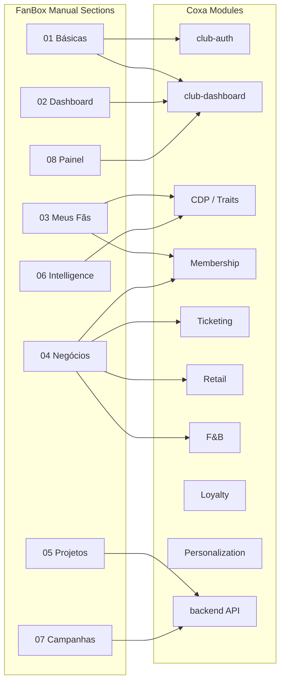
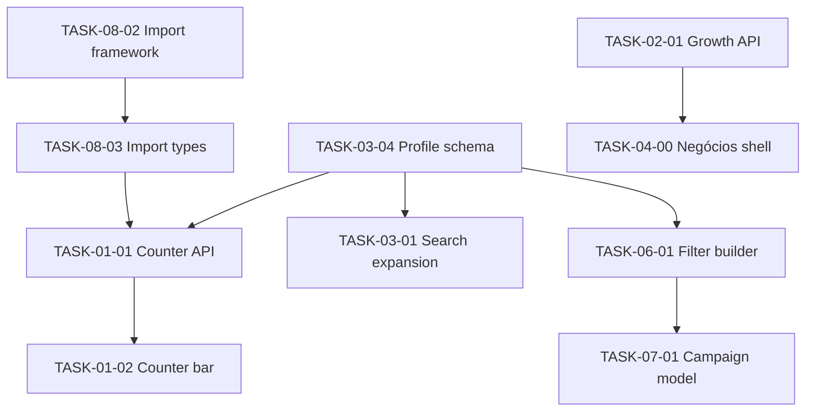

# FanBox Parity — Detailed Tasks Document

**Source:** *Manual do FanBox · Coritiba SAF · v1.0 · 03/06/2026* (`Manual_FanBox_CoritibaSAF.pdf`)

**Target platform:** Coxa Fan OS (`fanbox-dashboard`, `backend` module `/api/v1/fanbox`)

**Purpose:** Translate every FanBox operational capability into actionable engineering tasks for Coxa, with gap analysis against what already exists in this repository.

**Project deadline:** **Friday, 20 June 2026 (EOD)** — all phases must be complete by end of next week.

**Schedule window:** 10 June 2026 → 20 June 2026 (8 working days)

**Related docs:** [PROJECT_OVERVIEW.md](./PROJECT_OVERVIEW.md) · [CLIENT_FEATURES.md](./CLIENT_FEATURES.md) · [RETAIL_TIER_A_IMPLEMENTATION_PLAN.md](./RETAIL_TIER_A_IMPLEMENTATION_PLAN.md)

---

## 1. Executive summary

FanBox is Coritiba SAF’s fan intelligence and marketing operations platform. Coxa already implements several foundational modules (CDP, Customer 360, segments, membership, ticketing, retail, F&B, loyalty, personalization). This document maps FanBox’s **8 operational sections** to Coxa work items and identifies what is **done**, **partial**, or **missing**.

| FanBox section | Coxa equivalent (today) | Parity status |
|----------------|-------------------------|---------------|
| 01 — Informações Básicas | `club-auth`, `DashboardLayout`, RBAC | **Partial** — login exists; global fan counters and FanBox-style nav grouping missing |
| 02 — Dashboard Inicial | `OverviewPage` | **Partial** — module cards only; no growth charts, engagement/spend reports, CSV export |
| 03 — Meus Fãs | `CdpCustomer360Page`, `MemberDetailPage` | **Partial** — search limited; no engagement/personal-info aggregate dashboards |
| 04 — Negócios | Retail, F&B, Membership, Ticketing modules | **Partial** — operational UIs exist; no unified “Negócios” analytics layer with demographic breakdowns |
| 05 — Projetos Digitais | — | **Missing** — surveys, votes, raffles, contests, NPS |
| 06 — Fan Intelligence | `CdpSegmentsPage` | **Partial** — basic trait filters; no saved filter library, export, or “Meus Insights” |
| 07 — Campanhas | `CampaignParticipation` model only | **Missing** — no campaign builder, templates, scheduling, or delivery analytics |
| 08 — Painel de Controle | `UsersPage`, `RolesPage` | **Partial** — user management exists; no CSV import pipeline |

### Recommended delivery phases

| Phase | Scope | Outcome | **Deadline** |
|-------|-------|---------|--------------|
| **P0 — Shell & data foundation** | Global counters, FanBox nav IA, fan profile enrichment schema, import pipeline | Platform feels like FanBox; data can be loaded | **Thu 12 Jun 2026** |
| **P1 — Analytics core** | Dashboard charts, Negócios reports, engagement/personal-info screens | Staff can monitor base health and business KPIs | **Mon 16 Jun 2026** |
| **P2 — Fan Intelligence++** | Advanced filters, saved filters, CSV export, insights dashboard | Marketing can segment and export audiences | **Wed 18 Jun 2026** |
| **P3 — Projetos Digitais** | Surveys, votes, raffles, contests, NPS | Direct fan engagement + trait enrichment | **Thu 19 Jun 2026** |
| **P4 — Campanhas** | Email/push campaigns, templates, scheduling, analytics | Mass communication from filtered audiences | **Fri 20 Jun 2026** |

### Sprint calendar (deadline: 20 Jun 2026)

| Dates | Focus | Must ship |
|-------|-------|-----------|
| **10–12 Jun** (Wed–Fri) | P0 — foundation | Profile schema, CSV import MVP, fan counters, FanBox sidebar, expanded fan search |
| **13–16 Jun** (Mon–Mon) | P1 — analytics | Growth chart, engagement/spend reports, Single Fan View rows, Negócios shell + top 5 business reports |
| **17–18 Jun** (Tue–Wed) | P2 — intelligence | Saved filters, CSV export, Meus Insights, segment bridge |
| **19 Jun** (Thu) | P3 — digital projects | Survey + vote + raffle MVP; contest/NPS stubs acceptable if time-constrained |
| **20 Jun** (Fri) | P4 — campaigns + hardening | Campaign wizard, template list, send/schedule MVP, smoke tests, doc sign-off |

**Daily standup checkpoint:** blockers escalated same day; any phase slipping past its milestone date triggers scope cut to MVP (see Out of scope fallbacks below).

**MVP fallback if behind schedule (still due 20 Jun):** defer TASK-04-06 through 04-11 (App/OTT/Coxa Run integrations), TASK-05-04/05-05 (contests/NPS), and TASK-07-05 drag-and-drop builder (HTML template import only).

---

## 2. FanBox → Coxa module mapping

---

## 3. Section 01 — Informações Básicas

FanBox reference: login URL, lateral menu structure, and **global system counters** (total fans, fans with CPF, email, phone, address) visible on every screen.

### 3.1 Current state in Coxa

| Item | Status | Location |
|------|--------|----------|
| Login (email + password) | Done | `apps/club-auth`, `backend/src/routes/auth.js` |
| Post-login redirect to home | Done | `ProtectedRoute`, `OverviewPage` |
| Lateral sidebar menu | Done | `DashboardLayout.jsx` — grouped by Coxa modules (Retail, CDP, etc.), not FanBox IA |
| Global fan counters | Missing | — |
| Persistent counter bar on all pages | Missing | — |

### 3.2 Tasks

#### TASK-01-01 — Global fan counter API

**Priority:** P0 · **Effort:** M

- [ ] Create `GET /api/v1/analytics/fan-counters` returning:
  - `totalFans` — all active `FanProfile` records for tenant
  - `withCpf` — profiles where `cpf` (or national ID field) is present
  - `withEmail` — non-empty email
  - `withPhone` — non-empty phone
  - `withAddress` — address object complete (street + city minimum)
- [ ] Extend `FanProfile` schema with demographic/contact fields required by FanBox (see TASK-03-04)
- [ ] Add MongoDB indexes for counter aggregation performance
- [ ] Wire route behind `requireAuth` + `requireModule(CDP)` or global club-admin access

**Acceptance criteria:** API returns accurate counts within 2s for 100k profiles; counts update after profile create/update/import.

---

#### TASK-01-02 — Persistent counter bar in club-dashboard shell

**Priority:** P0 · **Effort:** S

- [ ] Add `FanCounterBar` component below sidebar brand or above main content
- [ ] Fetch counters on layout mount; refresh on club switch
- [ ] Display: Total fans · CPF · E-mail · Telefone · Endereço (labels configurable per locale)
- [ ] Match FanBox visual hierarchy (purple highlight in manual — use Coxa design tokens)

**Acceptance criteria:** Counters visible on every authenticated page; no layout shift on load.

---

#### TASK-01-03 — Reorganize sidebar to FanBox information architecture

**Priority:** P0 · **Effort:** M

Restructure `DashboardLayout.jsx` nav to mirror FanBox sections while preserving RBAC module gates:

| FanBox menu | Coxa routes (proposed) |
|-------------|------------------------|
| *(home)* Dashboard Inicial | `/` |
| Meus Fãs | `/fans/single`, `/fans/engagement`, `/fans/profiles` |
| Negócios | `/business/*` (sub-routes per source) |
| Projetos Digitais | `/projects/*` |
| Fan Intelligence | `/intelligence/filters`, `/intelligence/insights` |
| Campanhas | `/campaigns/*` |
| Painel de Controle | `/control/users`, `/control/import` |

- [ ] Add `MODULE.FANS`, `MODULE.BUSINESS`, `MODULE.PROJECTS`, `MODULE.CAMPAIGNS`, `MODULE.CONTROL` to `permissions.js` (or map to existing modules)
- [ ] Keep legacy deep links (`/retail/*`, `/cdp/*`) working via redirects
- [ ] Update `@coxa/rbac` seed / role defaults for new nav groups

**Acceptance criteria:** FanBox-trained staff can find all tools under expected menu names; permissions still enforced per role.

---

#### TASK-01-04 — Club-branded login (Coritiba / tenant theming)

**Priority:** P1 · **Effort:** S

- [ ] Support tenant logo, primary color, and custom login URL per club (`Club` model extension)
- [ ] Document deployment URL pattern (FanBox uses `coritiba.fanbox.app.br`)

**Acceptance criteria:** Coritiba tenant shows club branding on login; default Coxa branding for other tenants.

---

## 4. Section 02 — Dashboard Inicial

FanBox reference: fan base growth chart (new vs cumulative), engagement reports, spend reports, date range picker, chart download, CSV export, sortable columns, help tooltips.

### 4.1 Current state in Coxa

| Item | Status | Location |
|------|--------|----------|
| Welcome / club KPI cards | Partial | `OverviewPage` — CDP event count, segment count only |
| Fan growth chart | Missing | — |
| Engagement reports | Missing | — |
| Spend reports | Missing | — |
| Period filter | Missing | — |
| CSV / chart export | Missing | — |

### 4.2 Tasks

#### TASK-02-01 — Fan base growth time-series API

**Priority:** P1 · **Effort:** M

- [ ] Create `GET /api/v1/analytics/fan-growth?from=&to=&granularity=day|week|month`
- [ ] Return series: `{ date, newRegistrations, cumulativeTotal }`
- [ ] Source: `FanProfile.createdAt` grouped by period; include import batches if tracked

**Acceptance criteria:** Chart data matches manual count for seeded test data; empty periods return zero.

---

#### TASK-02-02 — Dashboard growth chart UI

**Priority:** P1 · **Effort:** M

- [ ] Replace or augment `OverviewPage` top section with dual-line chart (new registrations = light green, cumulative = dark green per FanBox manual)
- [ ] Date range picker (from / to)
- [ ] Download chart as PNG/SVG button
- [ ] Use lightweight chart library consistent with monorepo (e.g. Recharts — add to `club-dashboard` if not present)

**Acceptance criteria:** User can change period and see chart update; download produces usable image file.

---

#### TASK-02-03 — Engagement reports block

**Priority:** P1 · **Effort:** L

FanBox shows sortable engagement tables with CSV export and “?” help tooltips. Define Coxa engagement metrics aligned to available data:

| Report (proposed) | Data source |
|-------------------|-------------|
| Active fans (30d) | CDP events or last activity trait |
| Ticket buyers (season) | `Ticket` / `AttendanceRecord` |
| Member check-ins | `CheckInWindow` / attendance |
| App opens | Future app event integration |
| Campaign participants | `CampaignParticipation` |
| Survey respondents | Projetos Digitais (TASK-05-xx) |

- [ ] Create `GET /api/v1/analytics/engagement-reports?from=&to=`
- [ ] Build report table component with column sort, CSV export, tooltip definitions
- [ ] Place below growth chart on `OverviewPage`

**Acceptance criteria:** Each report row links to “Ver Detalhes” drill-down (raw data table or export).

---

#### TASK-02-04 — Spend reports block

**Priority:** P1 · **Effort:** L

- [ ] Create `GET /api/v1/analytics/spend-reports?from=&to=`
- [ ] Aggregate by channel: retail POS, fan shop, F&B, membership fees, ticketing
- [ ] Metrics: total spend, avg ticket, unique buyers, spend by member tier
- [ ] UI: same table pattern as TASK-02-03 with sort + CSV + tooltips

**Acceptance criteria:** Totals reconcile with `Sale`, `MembershipTransaction`, and ticket purchase records.

---

## 5. Section 03 — Meus Fãs

FanBox reference: three sub-screens — **Single Fan View**, **Engajamento**, **Informações Pessoais**.

### 5.1 Single Fan View (3.1)

FanBox capabilities:

- Search by: CPF, Name, Email, ID, Passport, Mobile
- Contact + engagement summary row
- Actions: send notification (email/push), edit registration
- Profile fields: locality, gender, birthday, interaction channels, spend last month/year
- Ticket purchases, membership plan
- E-commerce purchases, TV Coxa Prime subscription
- Coxa ID data, club relationship, brand consumption profile, digital products (favorite club, sports betting, social network)

#### TASK-03-01 — Expand Customer 360 search

**Priority:** P0 · **Effort:** M

- [ ] Extend `GET /api/v1/cdp/customer-360` search to accept: `cpf`, `fullName`, `email`, `fanId`, `passport`, `phone`
- [ ] Update `CdpCustomer360Page` with multi-field search form (single input with type selector, or dedicated fields)
- [ ] Rename/navigate as **Single Fan View** under Meus Fãs

**Acceptance criteria:** All FanBox search keys return correct profile or clear “not found”.

---

#### TASK-03-02 — Single Fan View layout (FanBox rows)

**Priority:** P1 · **Effort:** L

Rebuild `CdpCustomer360Page` in FanBox row structure:

| Row | Content |
|-----|---------|
| Row 1 | Contact, engagement KPIs, notify + edit actions |
| Row 2 | Tickets purchased, membership plan status |
| Row 3 | E-commerce orders, OTT/subscription status |
| Row 4 | Coxa ID traits, club affinity, consumption profile, digital behavior |

- [ ] “Ver Detalhes” on each widget opens underlying data table (tickets list, orders list, etc.)
- [ ] Edit registration opens slide-over form (`PATCH /api/v1/cdp/fan-profiles/:id`)
- [ ] Notify actions stub → wired in TASK-07-xx

**Acceptance criteria:** FanBox manual figures 7–10 information hierarchy is reproduced with Coxa data.

---

#### TASK-03-03 — Per-fan spend windows

**Priority:** P1 · **Effort:** S

- [ ] Add to Customer 360 API: `spendLast30DaysCents`, `spendLast365DaysCents` by channel
- [ ] Display in Row 1 KPI cards

---

#### TASK-03-04 — Fan profile enrichment schema

**Priority:** P0 · **Effort:** M

Extend `FanProfile` (or companion `FanDemographics` model) with FanBox fields:

- [ ] `cpf`, `passport`, `gender`, `birthDate`
- [ ] Address: `street`, `city`, `state`, `postalCode`, `country`
- [ ] `hasChildren`, `ageRange`, `householdIncomeBand` (enum buckets)
- [ ] `preferredSocialNetwork`, `sportsBetting`, `affinityClubId` (other club sympathy)
- [ ] `biometricRegistered` (boolean — FanBox filter example)
- [ ] `primaryInteractionChannels[]` (app, email, stadium, e-commerce, etc.)
- [ ] Migration/seed update for demo profiles

**Acceptance criteria:** Fields editable in admin UI; populate counters (TASK-01-01) and filters (TASK-06-01).

---

### 5.2 Engajamento (3.2)

FanBox: duplicate of home dashboard — growth chart + engagement/spend reports.

#### TASK-03-05 — Fans > Engajamento page

**Priority:** P2 · **Effort:** S

- [ ] Create `/fans/engagement` reusing components from TASK-02-02, TASK-02-03, TASK-02-04
- [ ] No new backend if APIs shared

**Acceptance criteria:** Identical data to dashboard; accessible from Meus Fãs menu.

---

### 5.3 Informações Pessoais (3.3)

FanBox: aggregate profile distribution — locality, children, age band, household income, etc.

#### TASK-03-06 — Fan demographic profile dashboard

**Priority:** P1 · **Effort:** M

- [ ] Create `GET /api/v1/analytics/fan-demographics` returning histograms:
  - By city/state/country
  - Gender distribution
  - Age band distribution
  - Has children (yes/no/unknown)
  - Income band distribution
- [ ] Build `/fans/profiles` page with bar/pie charts per dimension
- [ ] Period filter optional (snapshot = current base)

**Acceptance criteria:** Charts reflect enriched profile data; empty fields bucketed as “Unknown”.

---

## 6. Section 04 — Negócios

FanBox reference: unified business analytics for **10 data sources**, each with locality / gender / age breakdowns plus source-specific KPIs.

| FanBox source | Coxa mapping | Report status |
|---------------|--------------|---------------|
| Sócio Torcedor | `membership/*` | Partial — member list exists; no analytics dashboard |
| Ingressos | `ticketing/*` | Partial — events/tickets ops; no sales analytics |
| Acesso | `ticketing/check-in`, `AttendanceRecord` | Partial |
| Lojas | `retail/sales` (physical locations) | Partial — sales list; no analytics |
| E-Commerce | `retail/shop` | Partial |
| App Oficial | fan-app events | Missing |
| OTT (TV Coxa Prime) | external integration | Missing |
| Coxa Run | product line / channel tag | Missing |
| Coxa Foods | `fnb/sales` | Partial — F&B dashboard exists |
| Manto da Glória | product category filter on retail | Missing |

### 6.1 Shared Negócios infrastructure

#### TASK-04-00 — Negócios layout shell

**Priority:** P1 · **Effort:** M

- [ ] Create `/business` layout with sub-nav tabs for all 10 sources
- [ ] Shared header: date range picker (FanBox: “alterar período no cabeçalho”)
- [ ] Shared demographic breakdown toggles: Localidade · Gênero · Faixa etária
- [ ] Shared CSV export + “?” metric definitions

---

#### TASK-04-01 — Sócio Torcedor analytics

**Priority:** P1 · **Effort:** L

FanBox KPIs: sectors list, check-in counts, adimplentes vs inadimplentes, tenure, total spend.

- [ ] API: `GET /api/v1/analytics/business/membership?from=&to=`
- [ ] UI: `/business/membership`
- [ ] Charts/tables: plan distribution, sector breakdown, compliance status, avg tenure, revenue
- [ ] Demographic slices on all widgets

**Acceptance criteria:** Numbers match `FanMembership`, `MembershipTransaction`, check-in records.

---

#### TASK-04-02 — Ingressos analytics

**Priority:** P1 · **Effort:** L

- [ ] API: `GET /api/v1/analytics/business/tickets?from=&to=`
- [ ] KPIs: recent purchases, tickets per match, tickets per sector, sales per match
- [ ] UI: `/business/tickets`

---

#### TASK-04-03 — Acesso (stadium access) analytics

**Priority:** P1 · **Effort:** M

- [ ] API: `GET /api/v1/analytics/business/access?from=&to=`
- [ ] KPIs: total entries, member vs non-member attendance, repeat visitors
- [ ] Source: `AttendanceRecord`, gate scan events

---

#### TASK-04-04 — Lojas (retail stores) analytics

**Priority:** P1 · **Effort:** M

- [ ] API: `GET /api/v1/analytics/business/stores?from=&to=`
- [ ] KPIs: sales by location, top products, spend per fan, transaction count
- [ ] Filter `Sale` where `location.type` = physical store

---

#### TASK-04-05 — E-Commerce analytics

**Priority:** P1 · **Effort:** M

- [ ] API: `GET /api/v1/analytics/business/ecommerce?from=&to=`
- [ ] KPIs: top products, average ticket, buyers by membership plan
- [ ] Source: fan shop channel sales

---

#### TASK-04-06 — App Oficial analytics

**Priority:** P2 · **Effort:** L

- [ ] Define app event schema (`app.session`, `app.screen_view`, platform android/ios)
- [ ] Ingest from fan-app → CDP
- [ ] API + UI: `/business/app` — DAU/MAU, platform split, version adoption

---

#### TASK-04-07 — OTT / streaming analytics

**Priority:** P3 · **Effort:** L

- [ ] Integration adapter for TV Coxa Prime (or generic OTT webhook)
- [ ] Model: `OttSubscription` linked to `FanProfile`
- [ ] API + UI: `/business/ott` — active subs, churn, viewing engagement

---

#### TASK-04-08 — Coxa Run analytics

**Priority:** P3 · **Effort:** M

- [ ] Tag products/events with `channel: coxa_run` or dedicated product category
- [ ] API + UI: `/business/coxa-run` — kits sold, plans, total orders

---

#### TASK-04-09 — Coxa Foods analytics

**Priority:** P1 · **Effort:** S

- [ ] Extend existing `FnbSalesDashboardPage` metrics into `/business/coxa-foods`
- [ ] Add FanBox KPIs: items sold, revenue by match day, top items
- [ ] Demographic breakdowns per TASK-04-00

---

#### TASK-04-10 — Manto da Glória analytics

**Priority:** P2 · **Effort:** M

- [ ] Product category or collection filter for “Manto da Glória” SKUs
- [ ] API + UI: `/business/manto` — units sold, models ranking, member vs non-member buyers

---

#### TASK-04-11 — External integrations backlog

**Priority:** P3 · **Effort:** XL

FanBox notes: Bomache e-commerce integrated; Bling not yet integrated.

- [ ] Document integration priority: Bomache, Bling, Coxa Prime, legacy FanBox CSV formats
- [ ] Build connector framework under `backend/src/integrations/`
- [ ] Idempotent import → CDP events + domain records

---

## 7. Section 05 — Projetos Digitais

FanBox reference: **Pesquisas**, **Votações**, **Sorteios**, **Concursos**, **Outros Projetos (NPS)**.

**Current state:** No routes, models, or UI in Coxa for these features. `CampaignParticipation` exists but is not a full project engine.

### 7.1 Shared project engine

#### TASK-05-00 — Digital projects domain model

**Priority:** P3 · **Effort:** L

- [ ] Models: `DigitalProject` (type: survey | vote | raffle | contest | nps), `ProjectQuestion`, `ProjectResponse`, `ProjectSubmission` (contest attachments)
- [ ] Status lifecycle: draft → scheduled → active → closed → archived
- [ ] Link responses to `FanProfile`; emit `survey.completed`, `vote.cast`, `raffle.entered`, `contest.submitted` CDP events
- [ ] Survey answers map to fan profile enrichment fields (FanBox: “pesquisas preenchem Single Fan View”)

---

#### TASK-05-01 — Pesquisas (Surveys)

**Priority:** P3 · **Effort:** L

- [ ] Admin UI: `/projects/surveys` — list, create, view results
- [ ] Question types: single choice, multi, text, scale, date
- [ ] Fan-facing form in `fan-dashboard` or public link with auth
- [ ] Export / print results (PDF or CSV)
- [ ] Map answer keys → profile traits (configurable mapping table)

**Acceptance criteria:** Completing survey updates Single Fan View fields within 1 trait refresh cycle.

---

#### TASK-05-02 — Votações (Votes)

**Priority:** P3 · **Effort:** M

- [ ] Admin UI: `/projects/votes` — create vote, options, schedule, status tabs (in progress / scheduled / closed)
- [ ] Fan UI: cast one vote per fan per project
- [ ] Results view with percentages and participation count
- [ ] Example use case: Manto da Glória design selection (per manual)

---

#### TASK-05-03 — Sorteios (Raffles)

**Priority:** P3 · **Effort:** M

- [ ] Admin UI: `/projects/raffles` — create raffle, eligibility rules (e.g. members only)
- [ ] Participant list view; winner draw action (random, auditable seed)
- [ ] Winner list export

---

#### TASK-05-04 — Concursos (Contests)

**Priority:** P3 · **Effort:** L

- [ ] Admin UI: `/projects/contests` — create contest with custom form fields + file upload
- [ ] Submissions list; double-click opens submission detail (FanBox behavior)
- [ ] File storage (S3 or local dev bucket)

---

#### TASK-05-05 — Outros Projetos / NPS

**Priority:** P3 · **Effort:** M

- [ ] NPS project type with 0–10 score + optional comment
- [ ] Post-sale trigger hook (retail sale completed → send NPS link)
- [ ] Aggregate NPS dashboard widget

---

## 8. Section 06 — Fan Intelligence

FanBox reference: **Filtros** (combinable filters on all Single Fan View fields, export CSV, save filter) and **Meus Insights** (reports from saved filters).

### 8.1 Current state in Coxa

| Item | Status | Location |
|------|--------|----------|
| Trait-based segment builder | Partial | `CdpSegmentsPage`, `Segment` model |
| Combinable multi-field filters | Missing | — |
| Save named filters | Missing | — |
| Export filter results CSV | Missing | — |
| Insights dashboard | Missing | — |

### 8.2 Tasks

#### TASK-06-01 — Advanced filter builder

**Priority:** P2 · **Effort:** L

- [ ] Create `SavedFilter` model: `{ name, rules[], createdBy, tenantId }`
- [ ] Rule schema: `{ field, operator, value }` covering all FanProfile + trait + membership + ticket + spend fields
- [ ] UI: `/intelligence/filters` — visual filter builder with AND combination (FanBox: “centenas de filtros combinados”)
- [ ] Preview count before export
- [ ] Examples from manual: biometria cadastrada + sócio > 1 ano + behavior flags

**Acceptance criteria:** Filter preview count matches exported CSV row count.

---

#### TASK-06-02 — Export filtered fan list

**Priority:** P2 · **Effort:** M

- [ ] `POST /api/v1/intelligence/filters/:id/export` → CSV stream
- [ ] Columns: configurable; default contact + key traits
- [ ] Rate limit / async job for large exports (>50k rows)

---

#### TASK-06-03 — Save & manage filters

**Priority:** P2 · **Effort:** S

- [ ] Save filter button (FanBox: blue button)
- [ ] List saved filters with last run count and date
- [ ] Edit / duplicate / delete

---

#### TASK-06-04 — Meus Insights dashboard

**Priority:** P2 · **Effort:** M

- [ ] `/intelligence/insights` — pin saved filters as insight cards
- [ ] Each card: fan count, trend vs previous period, top 3 breakdown dimensions
- [ ] Optional scheduled refresh

---

#### TASK-06-05 — Bridge saved filters to segments

**Priority:** P2 · **Effort:** S

- [ ] “Promote to segment” action creates/updates `Segment` from `SavedFilter` rules
- [ ] Keeps compatibility with personalization / offers module

---

## 9. Section 07 — Campanhas

FanBox reference: create/edit/send mass **email**, **SMS**, **push** campaigns; recipient selection via saved filters; schedule or send immediately; templates with drag-and-drop builder; campaign analytics (sent, opened, etc.).

### 9.1 Current state in Coxa

| Item | Status |
|------|--------|
| `CampaignParticipation` model | Exists — participation tracking only |
| Campaign CRUD | Missing |
| Email/push delivery | Missing |
| Template builder | Missing |

### 9.2 Tasks

#### TASK-07-01 — Campaign domain model

**Priority:** P4 · **Effort:** L

- [ ] Models: `Campaign`, `CampaignTemplate`, `CampaignDelivery`, `CampaignMetric`
- [ ] Campaign fields: name, type (email | sms | push), status (draft | scheduled | sending | sent | cancelled)
- [ ] Content: subject, sender, templateId, body snapshot
- [ ] Recipients: `savedFilterId` or `segmentId`
- [ ] Schedule: `scheduledAt` optional

---

#### TASK-07-02 — Nova Campanha wizard

**Priority:** P4 · **Effort:** L

FanBox steps: name/type → content → recipients → review → send/schedule

- [ ] UI: `/campaigns/new` multi-step wizard
- [ ] Recipient step: pick saved filter (TASK-06-03)
- [ ] Review step: audience size, sample recipients, send test

---

#### TASK-07-03 — Minhas Campanhas list

**Priority:** P4 · **Effort:** M

- [ ] UI: `/campaigns` — tabs: drafts, scheduled, sent
- [ ] Sent campaigns: “Visualizar” opens delivery analytics

---

#### TASK-07-04 — Campaign analytics

**Priority:** P4 · **Effort:** M

- [ ] Track: sent, delivered, opened, clicked, bounced, unsubscribed (email); delivered, opened (push)
- [ ] Webhook handlers for email provider (SendGrid/SES) and push (FCM/APNs)
- [ ] UI mirrors FanBox figures 37–38

---

#### TASK-07-05 — Email template manager

**Priority:** P4 · **Effort:** XL

- [ ] UI: `/campaigns/templates` — list, create, edit, delete
- [ ] Create options: blank (drag-and-drop builder), duplicate existing, import HTML
- [ ] Builder: blocks for text, image, button, fan merge tags (`{{fan.firstName}}`)
- [ ] Preview + download HTML

---

#### TASK-07-06 — Notification delivery services

**Priority:** P4 · **Effort:** L

- [ ] `emailService` — queue + provider integration
- [ ] `pushService` — fan-app device tokens
- [ ] `smsService` — optional provider stub
- [ ] Background worker (Bull/BullMQ or cron) for scheduled sends
- [ ] Wire Single Fan View “notify” buttons (TASK-03-02) to one-off send using templates

---

#### TASK-07-07 — Single Fan View quick actions

**Priority:** P4 · **Effort:** S

- [ ] Email / push buttons on Customer 360 (FanBox yellow buttons)
- [ ] Opens compose modal with fan pre-selected

---

## 10. Section 08 — Painel de Controle

FanBox reference: **Gestão de Contas** (user CRUD + permissions) and **Importar arquivo** (CSV import for multiple entity types).

### 10.1 Gestão de Contas

#### TASK-08-01 — Account management parity

**Priority:** P0 · **Effort:** S

| FanBox capability | Coxa status |
|-------------------|-------------|
| Create user | Done — `UsersPage` invite |
| Edit user | Done — role update |
| Delete user | Verify — add deactivate/remove if missing |
| Permission scopes per module | Partial — role-based; add fine-grained module toggles if required |

- [ ] Audit `UsersPage` against FanBox permission matrix
- [ ] Add UI for module-level access toggles per user (if not covered by roles)
- [ ] Move under `/control/users` with FanBox labeling

**Acceptance criteria:** Club admin can manage staff accounts without developer intervention.

---

### 10.2 Importar arquivo

FanBox supported import types:

1. Cadastros (registrations)
2. Planos de Assinatura
3. Ingressos e Acessos
4. Compra de Produtos/Serviços
5. Eventos
6. Status de Planos de Assinatura
7. Eventos do App
8. Leads

#### TASK-08-02 — CSV import framework

**Priority:** P0 · **Effort:** L

- [ ] UI: `/control/import` — upload CSV, select import type, preview, confirm
- [ ] Backend: `POST /api/v1/import/:type` with validation report
- [ ] Job tracking: `{ importId, status, rowsOk, rowsFailed, errorLog[] }`
- [ ] Idempotency via external reference column

---

#### TASK-08-03 — Import type implementations

**Priority:** P0 · **Effort:** XL (split per type)

| Import type | Target model(s) | Priority |
|-------------|-----------------|----------|
| Cadastros | `FanProfile` + demographics | P0 |
| Planos de Assinatura | `MembershipPlan` | P1 |
| Ingressos e Acessos | `Ticket`, `AttendanceRecord` | P1 |
| Compra Produtos/Serviços | `Sale` | P1 |
| Eventos | `MatchEvent`, `CdpEvent` | P1 |
| Status Planos | `FanMembership` status | P1 |
| Eventos do App | `CdpEvent` | P2 |
| Leads | `FanProfile` (status=lead) | P2 |

- [ ] Publish CSV templates per type (`docs/import-templates/*.csv`)
- [ ] FanBox migration: document column mapping from legacy exports

**Acceptance criteria:** Import 10k registration rows without duplicate fan IDs; failed rows downloadable as error CSV.

---

## 11. Cross-cutting tasks

#### TASK-X-01 — Trait calculator expansion

**Priority:** P1 · **Effort:** M

- [ ] Extend `traitCalculator.js` for new profile fields, spend windows, membership tenure, biometric flag
- [ ] Ensure traits power filters (TASK-06-01) and segments

---

#### TASK-X-02 — API client & permissions update

**Priority:** P0 · **Effort:** M

- [ ] Add all new endpoints to `apps/club-dashboard/src/lib/api.js`
- [ ] Register modules in `TenantConfig.enabledModules` seed
- [ ] Update `ProtectedRoute` / `ModuleRoute` for new paths

---

#### TASK-X-03 — i18n (PT-BR / EN)

**Priority:** P2 · **Effort:** M

FanBox manual is Portuguese. Coritiba ops expect PT-BR labels.

- [ ] Extract FanBox-facing strings to i18n dictionary
- [ ] Default PT-BR for Coritiba tenant; EN fallback

---

#### TASK-X-04 — Documentation & training

**Priority:** P2 · **Effort:** S

- [ ] Update `CLIENT_FEATURES.md` with FanBox parity section
- [ ] Produce Coxa operational manual mirroring FanBox section numbers for staff training

---

#### TASK-X-05 — E2E test plan

**Priority:** P2 · **Effort:** M

- [ ] Smoke tests: login → counters → search fan → export filter → import CSV
- [ ] Regression suite for existing retail/ticketing/membership flows after nav restructure

---

## 12. Dependency graph (critical path)

**Critical path for demo parity:** TASK-03-04 → TASK-08-02 → TASK-01-01 → TASK-03-01 → TASK-02-01 → TASK-04-00

---

## 13. Effort legend

| Size | Indicative effort |
|------|-------------------|
| S | 0.5–1 day |
| M | 2–3 days |
| L | 4–8 days |
| XL | 2+ weeks |

---

## 14. Out of scope (this document)

- Replacing FanBox production URL (`coritiba.fanbox.app.br`) — deployment task per [AWS_DEPLOYMENT.md](./AWS_DEPLOYMENT.md)
- Full Bomache/Bling/e-commerce connector build (tracked in TASK-04-11)
- Fan mobile app rebuild (only analytics ingestion in TASK-04-06)
- Data migration execution from FanBox production DB (separate migration runbook)

---

## 15. Task index (quick reference)

| ID | Title | Phase | **Due by** |
|----|-------|-------|------------|
| TASK-01-01 | Global fan counter API | P0 | 12 Jun 2026 |
| TASK-01-02 | Persistent counter bar | P0 | 12 Jun 2026 |
| TASK-01-03 | FanBox sidebar IA | P0 | 12 Jun 2026 |
| TASK-01-04 | Tenant login branding | P1 | 16 Jun 2026 |
| TASK-02-01 | Fan growth time-series API | P1 | 14 Jun 2026 |
| TASK-02-02 | Dashboard growth chart | P1 | 15 Jun 2026 |
| TASK-02-03 | Engagement reports | P1 | 16 Jun 2026 |
| TASK-02-04 | Spend reports | P1 | 16 Jun 2026 |
| TASK-03-01 | Expand Customer 360 search | P0 | 11 Jun 2026 |
| TASK-03-02 | Single Fan View layout | P1 | 15 Jun 2026 |
| TASK-03-03 | Per-fan spend windows | P1 | 15 Jun 2026 |
| TASK-03-04 | Fan profile enrichment schema | P0 | 11 Jun 2026 |
| TASK-03-05 | Fans > Engajamento page | P2 | 18 Jun 2026 |
| TASK-03-06 | Demographic profile dashboard | P1 | 16 Jun 2026 |
| TASK-04-00 | Negócios layout shell | P1 | 14 Jun 2026 |
| TASK-04-01 … 04-05, 04-09 | Core business analytics | P1 | 16 Jun 2026 |
| TASK-04-06 … 04-11 | Extended integrations / analytics | P3 | 19 Jun 2026 (fallback: defer) |
| TASK-05-00 … 05-03 | Surveys, votes, raffles | P3 | 19 Jun 2026 |
| TASK-05-04 … 05-05 | Contests, NPS | P3 | 19 Jun 2026 (fallback: defer) |
| TASK-06-01 … 06-05 | Fan Intelligence | P2 | 18 Jun 2026 |
| TASK-07-01 … 07-07 | Campanhas | P4 | 20 Jun 2026 |
| TASK-08-01 | Account management parity | P0 | 12 Jun 2026 |
| TASK-08-02 … 08-03 | CSV import | P0 | 12 Jun 2026 |
| TASK-X-01 … X-05 | Cross-cutting | P0–P2 | 18 Jun 2026 |

---

*Document generated from Manual do FanBox (Coritiba SAF, v1.0) mapped against Coxa repository state — June 2026.*

**Final delivery deadline: Friday, 20 June 2026.**
