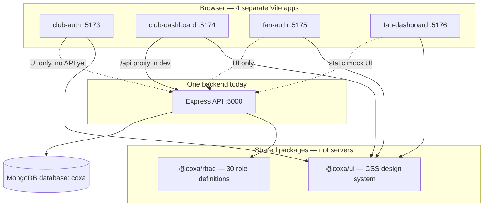

# Coxa Fan OS — Project Overview

A single guide to understand **what this repo is**, **how the pieces fit together**, and **what is built vs planned**.

---

## 1. What is Coxa?

**Coxa** (repo: `coxa-1touch`) is a **Fan Operating System** — a multi-tenant platform for football clubs (and similar organizations) to run:

- **Staff / club operations** (admin, roles, settings)
- **Fan experiences** (tickets, wallet, rewards, profile)
- Future modules: POS, gates, kiosks, vendors, support, etc.

Right now it is an **MVP scaffold**: one backend API, four web apps, shared design system, and a **role-based access control (RBAC) foundation**. Most business features (real login, ticketing, payments) are **not implemented yet**.

Think of the current state as:

> “The skeleton of a stadium” — structure, wiring, and admin shell — not the full matchday product.

---

## 2. Tech stack (MERN monorepo)

| Layer | Technology | Where |
|-------|------------|--------|
| **M**ongoDB | Database `coxa` | Local or Atlas |
| **E**xpress | REST API on port **5000** | `backend/` |
| **R**eact | Vite + React 19 | `apps/*` |
| **N**ode.js | ESM, **npm workspaces** | Root `package.json` |

**Node:** version **≥ 20** (you have v22).

**Package manager:** npm workspaces link `backend`, `apps/*`, and `packages/*` together.

---

## 3. Big picture architecture



### Important ideas

1. **One API, many frontends** — All apps talk to the same Express server (today only `club-dashboard` actually calls it).
2. **Monorepo** — One `git clone`, one `npm install`, shared packages.
3. **Multi-tenant ready** — Every request carries a `tenantId` (MVP uses one club: `coxa-club-001`).
4. **Roles in code + DB** — Role *definitions* live in `@coxa/rbac`; role *assignments* live in MongoDB.

---

## 4. Repository layout

```
coxa-1touch/
├── backend/                 # Express + Mongoose API
│   └── src/
│       ├── server.js        # App entry, routes, CORS
│       ├── config/db.js     # MongoDB connection
│       ├── models/          # User, RoleAssignment schemas
│       ├── routes/          # users, roles, assignments
│       ├── middleware/      # requestContext (tenant headers)
│       └── scripts/seed.js  # Demo data
│
├── apps/                    # React (Vite) frontends
│   ├── club-auth/           # Staff login UI
│   ├── club-dashboard/      # Club admin (API-connected)
│   ├── fan-auth/            # Fan login/signup UI
│   ├── fan-dashboard/       # Fan portal UI (mock data)
│   └── [placeholders]/      # admin-console, pos-app, etc. — NOT wired
│
├── packages/
│   ├── rbac/                # 30 roles registry (JavaScript)
│   ├── ui/                  # Shared CSS (@coxa/ui)
│   └── shared-types/        # TypeScript types (future use)
│
├── docs/
│   ├── PROJECT_OVERVIEW.md  # ← this file
│   ├── DESIGN.md            # Design tokens & components
│   └── HOSTING.md           # Production deployment
│
├── .env                     # Local secrets (not in git)
└── package.json             # Root scripts: dev, seed, build
```

---

## 5. The four web apps (who uses what)

| App | Port | Audience | Status today |
|-----|------|----------|--------------|
| **club-auth** | 5173 | Club staff login | **UI only** — form does not call API |
| **club-dashboard** | 5174 | Club admins | **Live API** — users & roles from MongoDB |
| **fan-auth** | 5175 | Fans sign up / login | **UI only** |
| **fan-dashboard** | 5176 | Fans (tickets, wallet) | **Static mock** — hardcoded “R$ 0,00”, no API |

### Club dashboard pages

| Route | Page | Data source |
|-------|------|-------------|
| `/` | Overview | Static copy |
| `/roles` | Role registry | API `GET /api/v1/roles` (30 roles from `@coxa/rbac`) |
| `/users` | Staff & users | API `GET /api/v1/users` (MongoDB `users` collection) |
| `/settings` | Settings | Placeholder |

### Fan dashboard pages

Home, Tickets, Wallet, Rewards, Profile — **layout and design only**, no backend calls yet.

---

## 6. Backend API

**Base URL (dev):** `http://localhost:5000`

### How the API starts

1. Loads `.env` from **repo root**
2. Connects to MongoDB (`MONGODB_URI`)
3. Attaches middleware (`requestContext`, CORS, JSON body)
4. Mounts routers under `/api/v1/...`

### Request context (multi-tenant)

Every API request gets a `req.ctx` object from headers (or defaults):

| Header | Purpose | Default |
|--------|---------|---------|
| `x-tenant-id` | Which club/tenant | `DEFAULT_TENANT_ID` → `coxa-club-001` |
| `x-user-id` | Acting user (future auth) | — |
| `x-request-id` | Tracing | auto UUID |

`club-dashboard` sends `x-tenant-id: coxa-club-001` on every fetch.

### Endpoints

| Method | Path | Description |
|--------|------|-------------|
| GET | `/api/health` | Health check |
| GET | `/api/v1/roles` | List all 30 role definitions |
| GET | `/api/v1/roles/staff` | Staff roles only |
| GET | `/api/v1/roles/:code` | One role by code |
| GET | `/api/v1/users` | List users for tenant |
| GET | `/api/v1/users/:id` | User + their role assignments |
| POST | `/api/v1/users` | Create user |
| GET | `/api/v1/assignments/users/:userId/roles` | User’s roles |
| POST | `/api/v1/assignments/users/:userId/roles` | Assign role |
| DELETE | `/api/v1/assignments/users/:userId/roles/:assignmentId` | Revoke role |

**Not built yet:** login, JWT, passwords, permissions checks on routes.

---

## 7. MongoDB — what is stored

**Connection:** `mongodb://localhost:27017/coxa` (database name = **`coxa`**)

MongoDB does **not** show SQL-style schemas in Compass. Schemas are defined in **Mongoose models** in code; the DB only stores **collections** and **JSON documents**.

### Collections (created when you seed)

| Collection | Model | What it stores |
|------------|-------|----------------|
| **`users`** | `User` | People: email, name, accountType (`fan` \| `staff` \| `vendor` \| `service`), status |
| **`roleassignments`** | `RoleAssignment` | Links `userId` → `roleCode` for a tenant |

Mongoose pluralizes model names: `User` → `users`, `RoleAssignment` → `roleassignments`.

### User document example

```json
{
  "tenantId": "coxa-club-001",
  "email": "admin@coxa.local",
  "name": "Club Admin",
  "accountType": "staff",
  "status": "active"
}
```

### Role assignment example

```json
{
  "tenantId": "coxa-club-001",
  "userId": "<ObjectId of user>",
  "roleCode": "club_admin",
  "status": "active"
}
```

### Seed data (`npm run seed`)

| Email | Name | Type | Role assigned |
|-------|------|------|----------------|
| admin@coxa.local | Club Admin | staff | `club_admin` |
| support@coxa.local | Support Agent | staff | `support_agent` |
| fan@coxa.local | Demo Fan | fan | `fan_member` |

Seed is **idempotent** — safe to run again; it won’t duplicate users/roles.

---

## 8. RBAC package (`@coxa/rbac`)

**Location:** `packages/rbac/`

This package is the **catalog of roles** for the whole Fan OS — not permissions yet.

- **30 roles** defined in `ROLE_REGISTRY` (e.g. `club_admin`, `gate_operator`, `fan_member`)
- Used by:
  - API `/api/v1/roles` (returns definitions to the dashboard)
  - Seed script (validates role codes)
  - Future: JWT claims, permission matrix

**Roles live in two places:**

| What | Where | Example |
|------|--------|---------|
| Role **definition** (name, description, scope) | `@coxa/rbac` code | “Club Admin” |
| Role **assignment** (user X has role Y) | MongoDB `roleassignments` | admin has `club_admin` |

**Permissions** (what each role can *do*) are explicitly **out of scope** for this MVP — noted in code comments.

---

## 9. Design system (`@coxa/ui`)

**Location:** `packages/ui/`

All four apps import the same CSS:

```javascript
import "@coxa/ui/styles.css";
```

- Shared colors, typography (DM Sans), cards, tables, auth layouts
- See **[DESIGN.md](./DESIGN.md)** for tokens and component classes

Club and fan apps look the same; difference is **copy and routes**, not different color themes.

---

## 10. How dev networking works

In development, each Vite app **proxies** `/api` to the backend:

```
Browser → http://localhost:5174/api/v1/users
         → Vite proxy → http://localhost:5000/api/v1/users
         → Express → MongoDB
```

So the dashboard uses **relative URLs** (`/api/...`) — no `VITE_API_URL` needed locally.

`npm run dev` starts **5 processes** at once (via `concurrently`):

1. API (nodemon)
2. club-auth
3. club-dashboard
4. fan-auth
5. fan-dashboard

---

## 11. Environment variables

File: **`.env`** at repo root (copy from `.env.example`)

| Variable | Purpose |
|----------|---------|
| `MONGODB_URI` | MongoDB connection string |
| `API_PORT` | Backend port (default 5000) |
| `NODE_ENV` | `development` or `production` |
| `CLIENT_URL` | CORS allowed origin (one URL today) |
| `DEFAULT_TENANT_ID` | Default club tenant for MVP |

---

## 12. Commands cheat sheet

```bash
cd coxa-1touch
npm install          # once
cp .env.example .env # once (Windows: copy .env.example .env)
npm run seed         # load demo users into MongoDB
npm run dev          # API + all 4 apps
```

| Command | Runs |
|---------|------|
| `npm run dev` | Everything |
| `npm run dev:backend` | API only |
| `npm run dev:club-dashboard` | Club dashboard only |
| `npm run build` | Production build of all 4 frontends |

**Verify API:** http://localhost:5000/api/health

**Main UI to explore:** http://localhost:5174 → Users & Roles

---

## 13. What is NOT in the repo yet

Understanding this avoids confusion:

| Feature | Status |
|---------|--------|
| Real authentication (login, JWT, sessions) | Not built — auth pages are UI shells |
| Passwords / OAuth | Not built |
| Permission enforcement on API routes | Not built |
| Ticketing, payments, loyalty, POS | Placeholder app folders only |
| Microservices | Planned for later; **one** Express app today |
| Fan onboarding flow | Explicitly excluded per README |

### Placeholder app folders (do not run)

`admin-console`, `fan-app`, `pos-app`, `kiosk-app`, `gate-app`, `vendor-portal`, `support-console` — README stubs for future surfaces, **not** in `package.json` workspaces.

---

## 14. Typical confusion — answered

### “Are we using MongoDB?”

**Yes.** Users and role assignments are in database **`coxa`**. Roles *definitions* are mostly served from code (`@coxa/rbac`), not stored as a separate collection.

### “Why no schema in Compass?”

MongoDB is document-based. **Schema = Mongoose models** in `backend/src/models/`. Compass shows **collections + documents**, not SQL tables.

### “Why is fan dashboard empty?”

It shows **hardcoded placeholder** text (“R$ 0,00”, “0 pts”) — it never calls the API yet.

### “Why doesn’t login work?”

`club-auth` / `fan-auth` forms use `e.preventDefault()` only — **no API call** on submit.

### “What’s the difference between roles in the UI vs MongoDB?”

- **Roles page** → 30 role *definitions* from API (from `@coxa/rbac` package)
- **Users in DB** → only 3 seeded users; each has assignments in `roleassignments`

### “What is a tenant?”

One club (or organization) on the platform. MVP simulates **one tenant**: `coxa-club-001`. Multi-club SaaS would use different `tenantId` per club.

---

## 15. Roadmap (inferred from code & docs)

Likely build order:

1. **Auth** — login API, JWT, protect routes  
2. **Permissions** — matrix per role, middleware checks  
3. **Club modules** — ticketing, retail, gates (new routes + apps)  
4. **Fan features** — wire fan-dashboard to real APIs  
5. **Production** — see [HOSTING.md](./HOSTING.md) (Atlas, Nginx, PM2, CORS for 4 domains)

---

## 16. Related documentation

| Doc | Topic |
|-----|--------|
| [README.md](../README.md) | Quick start |
| [DESIGN.md](./DESIGN.md) | UI tokens & components |
| [HOSTING.md](./HOSTING.md) | Production deployment |
| [apps/README.md](../apps/README.md) | App ports and purpose |

---

## 17. One-page mental model

```
┌─────────────────────────────────────────────────────────────┐
│  COXA = Club + Fan platform (future: tickets, POS, etc.)   │
├─────────────────────────────────────────────────────────────┤
│  TODAY:                                                      │
│    • 4 React apps (mostly UI)                                │
│    • 1 Express API                                           │
│    • MongoDB: users + roleassignments                        │
│    • 30 roles defined in code, 3 demo users in DB            │
│    • club-dashboard = only app fully talking to API          │
├─────────────────────────────────────────────────────────────┤
│  YOU RUN: MongoDB → npm run seed → npm run dev               │
│  YOU CHECK: Compass db "coxa" OR http://localhost:5174       │
└─────────────────────────────────────────────────────────────┘
```

---

*Last updated: May 2026 — matches repo state at MVP scaffold.*
