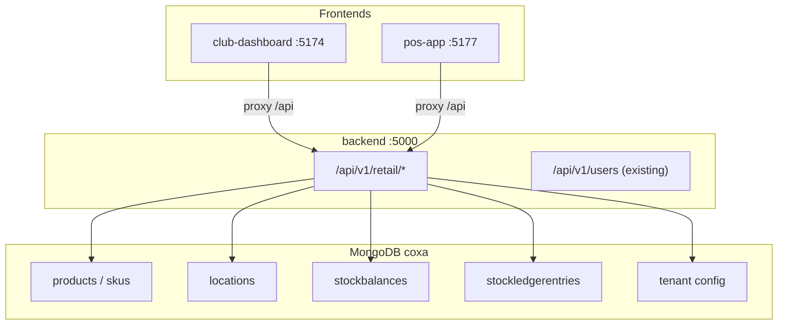

# Retail Tier A — Implementation Plan (Approval Required)

**Status:** Implemented on branch `feature/retail-tier-a-foundation` (May 2026).

This document describes **how** to deliver Tier A (Module 08 foundation) in `coxa-1touch`, what will change, what will not, and how to verify success. Use it for stakeholder approval before development starts.

**Related docs:** [PROJECT_OVERVIEW.md](./PROJECT_OVERVIEW.md) · Fan OS build plan (Module 08: Retail Catalog, Inventory and POS)

---

## 1. Executive summary

Tier A adds the **first retail slice**: catalog, locations, stock balances, stock ledger, club-admin UI, and a read-only POS catalog app. It does **not** add payments, fiscal receipts, offline sync, or full permission enforcement.

| Question | Answer |
|----------|--------|
| Can we do Tier A in one day? | Yes, if scope stays as defined below (no Tier B sales/checkout). |
| Will anything change in the repo? | **Yes.** New backend models/routes, seed updates, club-dashboard pages, new `pos-app` package, root `package.json` scripts. |
| Will existing features break? | **Not intended.** Users/Roles APIs and current dashboard pages should behave the same if we only **add** routes and nav items. |
| Is Tier A “complete” retail? | **No.** It is the foundation; POS payment, returns, events, and checkout come later. |

---

## 2. Will changes occur?

**Yes — Tier A is not “invisible.”** It is additive, but it touches several areas.

### 2.1 What stays the same (no behavioral change planned)

| Area | Notes |
|------|--------|
| `fan-auth`, `fan-dashboard`, `club-auth` | No edits required for Tier A |
| Existing `/api/v1/users`, `/api/v1/roles`, `/api/v1/assignments` | Keep current behavior |
| MongoDB collections `users`, `roleassignments` | Existing documents unchanged; seed only **adds** if missing |
| `@coxa/rbac` role definitions | No change to the 30-role registry |
| `.env` variables | No new required env vars (optional: `DEFAULT_MODULE=retail` later) |

### 2.2 What will change (new or modified files)

| Area | Change type |
|------|-------------|
| `backend/src/models/` | **New** 5–6 Mongoose models |
| `backend/src/routes/retail/` | **New** route modules |
| `backend/src/server.js` | **Modified** — mount retail router |
| `backend/src/scripts/seed.js` | **Modified** — tenant module flag, retail users, products, stock |
| `apps/club-dashboard/` | **Modified** — nav, routes, `api.js`, **new** pages |
| `apps/pos-app/` | **New** full Vite app (today only README) |
| Root `package.json` | **Modified** — workspace + `dev` script |
| `package-lock.json` | **Updated** after `npm install` |
| `docs/PROJECT_OVERVIEW.md` | **Optional** — short “Retail Tier A” section after delivery |

### 2.3 New MongoDB collections (after seed)

| Collection | Purpose |
|------------|---------|
| `tenants` (or `tenantconfigs`) | `enabledModules: ["retail", ...]` |
| `categories` | Product categories |
| `products` | Merchandise header (name, description, status) |
| `skus` | SKU code, barcode, price, variant, `productId` |
| `locations` | Warehouse, stadium store, online channel |
| `stockbalances` | Current qty per tenant + location + SKU |
| `stockledgerentries` | Immutable stock movements |

Existing DB name remains **`coxa`** (from `MONGODB_URI`).

---

## 3. Architecture (Tier A)



**Design choice:** Implement retail inside the **existing Express monolith** (`backend/`), not as separate microservices yet. Matches doc guidance: “package related services initially, keep data ownership separated” — we separate **collections and route namespaces** first.

---

## 4. Data model specification

All documents include `tenantId` (string, required, indexed). Use same patterns as `User.js` (`timestamps`, `status` enum where relevant).

### 4.1 `TenantConfig` (thin Module 01)

```javascript
{
  tenantId: "coxa-club-001",
  clubName: "Coxa Club",
  enabledModules: ["platform_admin", "identity", "retail"],
  currency: "BRL",
  timezone: "America/Sao_Paulo"
}
```

- One document per tenant for MVP.
- Retail routes may check `enabledModules.includes("retail")` (return `403 MODULE_DISABLED` if off).

### 4.2 `Category`

```javascript
{
  tenantId, code, name, status: "active" | "inactive"
}
```

Example codes: `apparel`, `accessories`.

### 4.3 `Product`

```javascript
{
  tenantId,
  name,           // e.g. "Home Jersey 2026"
  description,
  categoryId,     // ref Category
  status: "active" | "inactive" | "archived"
}
```

### 4.4 `Sku` (separate collection — easier for stock keys)

```javascript
{
  tenantId,
  productId,      // ref Product
  skuCode,        // unique per tenant, e.g. "JERSEY-26-M"
  barcode,        // optional EAN
  variantLabel,   // e.g. "M / Blue"
  priceCents,     // integer (avoid float money)
  minQty,         // for future low-stock alert
  status: "active" | "inactive"
}
```

Index: `{ tenantId: 1, skuCode: 1 }` unique.

### 4.5 `Location`

```javascript
{
  tenantId,
  code,           // "warehouse", "stadium_store", "online"
  name,
  type: "warehouse" | "store" | "online",
  status: "active" | "inactive"
}
```

### 4.6 `StockBalance`

```javascript
{
  tenantId,
  locationId,
  skuId,
  qtyOnHand       // number >= 0
}
```

Index: `{ tenantId: 1, locationId: 1, skuId: 1 }` unique.

### 4.7 `StockLedgerEntry` (append-only)

```javascript
{
  tenantId,
  locationId,
  skuId,
  type: "receive" | "sale" | "adjustment" | "transfer",
  qtyDelta,       // signed: +in, -out
  balanceAfter,   // snapshot after apply
  referenceType,  // "adjustment" | "seed" | "transfer" (optional)
  referenceId,
  note,
  createdBy       // optional user id from x-user-id
}
```

**Rule:** Every change to `StockBalance` must create a ledger row in the same transaction (MongoDB session).

---

## 5. API specification (`/api/v1/retail`)

Headers (same as today):

| Header | Required | Example |
|--------|----------|---------|
| `x-tenant-id` | Yes (or default from env) | `coxa-club-001` |
| `x-module-code` | Optional | `retail` |
| `x-user-id` | Optional | acting staff id |

### 5.1 Products

| Method | Path | Body / query | Response |
|--------|------|--------------|----------|
| GET | `/products` | `?categoryId=&status=` | `{ data: Product[], total }` |
| POST | `/products` | `{ name, description?, categoryId?, skus?: [{ skuCode, barcode?, variantLabel?, priceCents }] }` | `{ data: Product }` (create product + optional SKUs) |
| GET | `/products/:id` | — | `{ data: { product, skus } }` |

### 5.2 Locations

| Method | Path | Body | Response |
|--------|------|------|----------|
| GET | `/locations` | — | `{ data: Location[], total }` |
| POST | `/locations` | `{ code, name, type }` | `{ data: Location }` |

### 5.3 Stock

| Method | Path | Body / query | Response |
|--------|------|--------------|----------|
| GET | `/stock` | `?locationId=` (optional) | `{ data: [{ sku, product, location, qtyOnHand }], total }` |
| POST | `/stock/adjustments` | `{ locationId, skuId, qtyDelta, note }` | `{ data: { balance, ledgerEntry } }` |

**Adjustment logic:**

1. Validate SKU and location belong to tenant.
2. Compute `newQty = qtyOnHand + qtyDelta`; reject if `newQty < 0`.
3. Update `StockBalance`, insert `StockLedgerEntry` with `type: "adjustment"`.

### 5.4 Health / module guard (optional)

| Method | Path | Response |
|--------|------|----------|
| GET | `/retail/status` | `{ module: "retail", enabled: true }` |

### 5.5 Error shape (unchanged)

```json
{ "code": "VALIDATION_ERROR", "message": "..." }
```

---

## 6. Seed data plan

Extend `backend/src/scripts/seed.js` (idempotent, same pattern as users).

### 6.1 Tenant + module flag

- Upsert `TenantConfig` with `enabledModules` including `"retail"`.

### 6.2 Users + roles

| Email | Roles to assign |
|-------|-----------------|
| `retail@coxa.local` | `retail_manager` |
| `cashier@coxa.local` | `pos_cashier` |

(Keep existing admin/support/fan seed.)

### 6.3 Catalog

| Product | SKUs | Price (example) |
|---------|------|-----------------|
| Home Jersey 2026 | `JERSEY-26-S`, `JERSEY-26-M` | R$ 299,00 |
| Club Cap | `CAP-001` | R$ 89,00 |
| Fan Scarf | `SCARF-001` | R$ 59,00 |

### 6.4 Locations

| Code | Name | Type |
|------|------|------|
| `warehouse` | Central Warehouse | warehouse |
| `stadium_store` | Stadium Store | store |

(Online channel can be Phase 1.1.)

### 6.5 Opening stock

| SKU | warehouse | stadium_store |
|-----|-----------|---------------|
| JERSEY-26-M | 50 | 10 |
| CAP-001 | 100 | 25 |
| SCARF-001 | 80 | 15 |

Each initial qty creates `StockBalance` + ledger `type: "receive"`, `note: "seed"`.

---

## 7. Backend implementation steps

Execute in order after approval.

| Step | Task | Files |
|------|------|-------|
| B1 | Create models | `backend/src/models/Category.js`, `Product.js`, `Sku.js`, `Location.js`, `StockBalance.js`, `StockLedgerEntry.js`, `TenantConfig.js` |
| B2 | Shared retail helpers | `backend/src/services/stockService.js` (apply delta + ledger in transaction) |
| B3 | Routes | `backend/src/routes/retail/products.js`, `locations.js`, `stock.js`, `index.js` (router aggregator) |
| B4 | Module guard middleware | `backend/src/middleware/requireModule.js` (checks `retail` enabled) |
| B5 | Register in server | `backend/src/server.js` → `app.use("/api/v1/retail", retailRouter)` |
| B6 | Extend seed | `backend/src/scripts/seed.js` |
| B7 | Manual test | Postman or `curl` against `:5000` |

**No new npm dependencies** expected (Mongoose already present).

---

## 8. Platform hooks (thin Module 01)

| Hook | Implementation |
|------|----------------|
| `enabledModules: ["retail"]` | `TenantConfig` document |
| Retail roles in seed | `RoleAssignment` for `retail_manager`, `pos_cashier` |
| `x-module-code: retail` | Already in `requestContext.js` → `req.ctx.moduleCode`; retail router can log or enforce later |

**Not in Tier A:** approval workflows, feature flags UI, location hierarchy beyond flat list, permission matrix per action.

---

## 9. Club dashboard UI plan

### 9.1 Navigation

Update `DashboardLayout.jsx` nav:

```
Overview | Roles | Users | Retail ▾ | Settings
```

Retail sub-routes (flat nav links acceptable for MVP):

- `/retail/products`
- `/retail/locations`
- `/retail/stock`

### 9.2 New pages

| Page | Features |
|------|----------|
| `RetailProductsPage.jsx` | Table of products; form: name + first SKU (code, price, barcode); calls `POST /products` |
| `RetailLocationsPage.jsx` | List locations; optional create form |
| `RetailStockPage.jsx` | Table: SKU, product name, location, qty; filter by location; “Adjust” modal → `POST /stock/adjustments` |

### 9.3 API client

Extend `apps/club-dashboard/src/lib/api.js`:

```javascript
listProducts(), createProduct(body), getProduct(id),
listLocations(), createLocation(body),
listStock(params), createStockAdjustment(body),
```

### 9.4 Routing

Update `App.jsx` with retail routes under `DashboardLayout`.

**Files touched:** `App.jsx`, `DashboardLayout.jsx`, `api.js`, 3 new pages in `src/pages/retail/`.

---

## 10. POS app (`pos-app`) plan

Today `apps/pos-app/` is README only. Tier A creates a minimal workspace app.

### 10.1 Package setup

| File | Purpose |
|------|---------|
| `apps/pos-app/package.json` | name `pos-app`, deps mirror `club-dashboard` |
| `apps/pos-app/vite.config.js` | port **5177**, proxy `/api` → `:5000` |
| `apps/pos-app/index.html` | DM Sans + theme |
| `apps/pos-app/src/main.jsx`, `App.jsx` | Router |
| `apps/pos-app/src/pages/CatalogPage.jsx` | Grid of SKUs from `GET /api/v1/retail/products` (or dedicated catalog endpoint) |
| `apps/pos-app/src/components/Cart.jsx` | Local state only — no checkout |

### 10.2 Root monorepo wiring

**`package.json` changes:**

```json
"workspaces": [ ..., "apps/pos-app" ],
"dev": "... + pos-app dev",
"dev:pos-app": "npm run dev --workspace=pos-app"
```

### 10.3 POS behavior (Tier A)

- Read-only catalog + “Add to cart” (localStorage or React state).
- Show prices from `priceCents`.
- Banner: “Payments not connected — demo cart only.”
- Header `x-tenant-id` + optional `x-module-code: retail`.

---

## 11. File checklist (complete list for reviewers)

### New files (~20)

```
backend/src/models/TenantConfig.js
backend/src/models/Category.js
backend/src/models/Product.js
backend/src/models/Sku.js
backend/src/models/Location.js
backend/src/models/StockBalance.js
backend/src/models/StockLedgerEntry.js
backend/src/services/stockService.js
backend/src/middleware/requireModule.js
backend/src/routes/retail/index.js
backend/src/routes/retail/products.js
backend/src/routes/retail/locations.js
backend/src/routes/retail/stock.js
apps/club-dashboard/src/pages/retail/RetailProductsPage.jsx
apps/club-dashboard/src/pages/retail/RetailLocationsPage.jsx
apps/club-dashboard/src/pages/retail/RetailStockPage.jsx
apps/pos-app/package.json
apps/pos-app/vite.config.js
apps/pos-app/index.html
apps/pos-app/src/main.jsx
apps/pos-app/src/App.jsx
apps/pos-app/src/pages/CatalogPage.jsx
apps/pos-app/src/lib/api.js
```

### Modified files (~6)

```
backend/src/server.js
backend/src/scripts/seed.js
package.json
package-lock.json
apps/club-dashboard/src/App.jsx
apps/club-dashboard/src/layouts/DashboardLayout.jsx
apps/club-dashboard/src/lib/api.js
```

---

## 12. Testing & acceptance criteria

### 12.1 Backend (after seed)

- [ ] `GET http://localhost:5000/api/v1/retail/products` returns ≥ 3 products
- [ ] `GET .../locations` returns 2 locations
- [ ] `GET .../stock?locationId=<stadium>` returns rows with qty
- [ ] `POST .../stock/adjustments` changes qty and creates ledger entry
- [ ] Compass shows new collections under database `coxa`

### 12.2 Club dashboard

- [ ] http://localhost:5174/retail/products lists seeded products
- [ ] Can create a new product from UI
- [ ] http://localhost:5174/retail/stock shows balances; adjustment updates table

### 12.3 POS app

- [ ] http://localhost:5177 shows product grid from API
- [ ] Cart adds items locally; no payment API called

### 12.4 Regression

- [ ] http://localhost:5174/users still shows 3+ users
- [ ] http://localhost:5174/roles still shows 30 roles
- [ ] `npm run seed` twice does not duplicate products/SKUs

---

## 13. Risks, limitations, and follow-ups

| Risk | Mitigation |
|------|------------|
| No auth — anyone with API access can adjust stock | Document as MVP; add JWT + permissions in next phase |
| CORS still single `CLIENT_URL` | Dev uses Vite proxy; production needs multi-origin (see HOSTING.md) |
| Money as cents — UI must format BRL | Shared formatter in club-dashboard/POS |
| Concurrent stock updates | Tier A: single-node OK; later use findOneAndUpdate with version or transactions |
| Seed re-run duplicates | Use upsert keys (`tenantId` + `skuCode`, etc.) |

### Explicitly out of scope (Tier B+)

- `POST /retail/sales`, returns, exchanges
- Checkout / Pix / wallet
- Fiscal NFC-e
- Offline POS queue
- Stock transfers workflow (approve/ship/receive)
- Event bus (`product.created`, etc.)
- ERPNext / Medusa adapter

---

## 14. Effort estimate

| Workstream | Estimate |
|------------|----------|
| Backend models + routes + seed | 3–4 h |
| Club dashboard retail pages | 2–3 h |
| POS app scaffold + catalog | 1.5–2 h |
| Testing + doc update | 1 h |
| **Total** | **~8 h (1 dev day)** |

---

## 15. Rollback plan

If approval is withdrawn after implementation:

1. Revert Git branch / PR.
2. Optional: drop retail collections in MongoDB:
   ```javascript
   // Compass or mongosh — only if no production data
   db.products.drop(); db.skus.drop(); db.locations.drop();
   db.stockbalances.drop(); db.stockledgerentries.drop();
   db.categories.drop(); db.tenantconfigs.drop();
   ```
3. `users` / `roleassignments` remain intact.

---

## 16. Approval checklist (sign-off)

| # | Question | Approver OK? |
|---|----------|--------------|
| 1 | Tier A scope is acceptable (no payments/fiscal/offline)? | ☐ |
| 2 | New MongoDB collections in `coxa` DB are acceptable? | ☐ |
| 3 | club-dashboard nav change is acceptable? | ☐ |
| 4 | New port **5177** for `pos-app` is acceptable? | ☐ |
| 5 | Stock adjustments open without role checks until auth phase? | ☐ |
| 6 | Seed users `retail@coxa.local` / `cashier@coxa.local` are acceptable? | ☐ |

**Approved by:** _______________ **Date:** _______________

---

## 17. Implementation command (after approval)

```powershell
cd c:\Users\hp\Desktop\Coxa\coxa-1touch
# developer implements per sections 7–10
npm run seed
npm run dev          # will include pos-app once wired
```

---

*Document version: 1.0 — planning only, aligned with Fan OS Module 08 MVP subset.*
